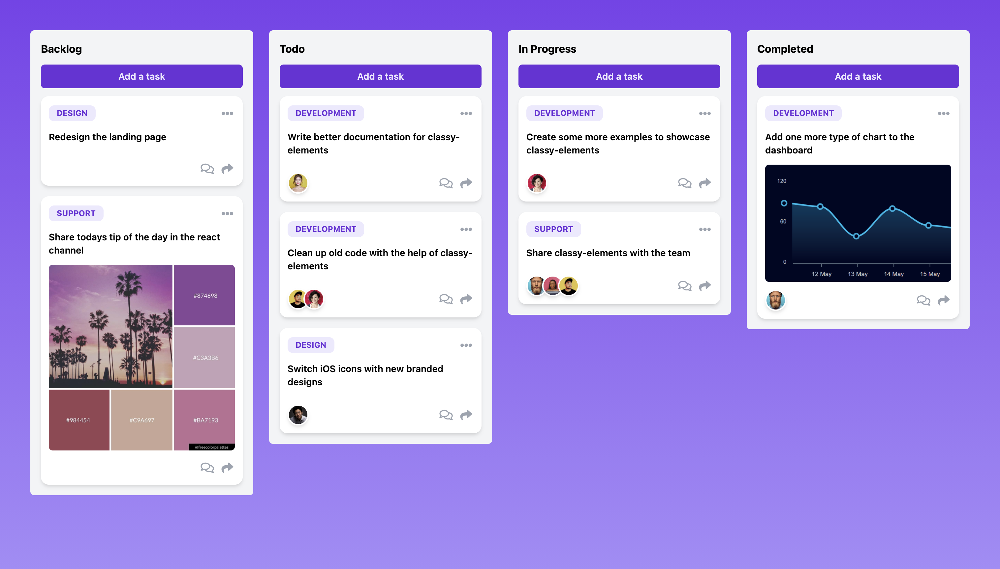

# Kanban UI

The kanban ui came in at around **~75 LOC** and is built from **3 primary components** and about **~20 elements** where used.

```
git clone git@github.com:hendore/classy-elements.git
cd ./classy-elements/demos/kanban-ui
npm install
npm run serve
```


